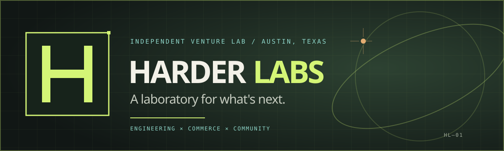

# Harder Labs

**An independent venture lab in Austin, Texas.**

We build and operate e-commerce brands, community platforms, and software products. We turn curious ideas into useful products, then keep improving them with real-world feedback.

[Explore the lab](https://harder.dev) · [Our projects](https://harder.dev/projects) · [About us](https://harder.dev/about) · [Get in touch](https://harder.dev/contact)

## Ideas out in the wild

| Venture | What it does |
| --- | --- |
| [Hill Country Gear](https://hillcountrygear.com) | Guides, clothing, and gear for exploring the Texas Hill Country. |
| [SharePuzzles](https://sharepuzzles.com) | A community puzzle exchange platform that helps people share puzzles and discover new ones. |
| [Stellar Arcade](https://stellararcade.com) | A marketplace for retro electronics, sci-fi and fantasy collectibles, and trading card games. |
| [Austin Puzzle Exchange](https://austinpuzzles.com) | Free neighborhood puzzle exchanges in Austin, Texas, where neighbors share and discover jigsaw puzzles. |

## From questions to working products

- **Find the question.** Start with a real need or a community worth bringing together.
- **Make it tangible.** Use practical engineering to put a working product in people's hands.
- **Keep it useful.** Listen to customers and let evidence guide the next iteration.

We also share what we learn about engineering, AI, and open source. Follow the [Signals reading list](https://harder.dev/signals) for releases we're watching.
